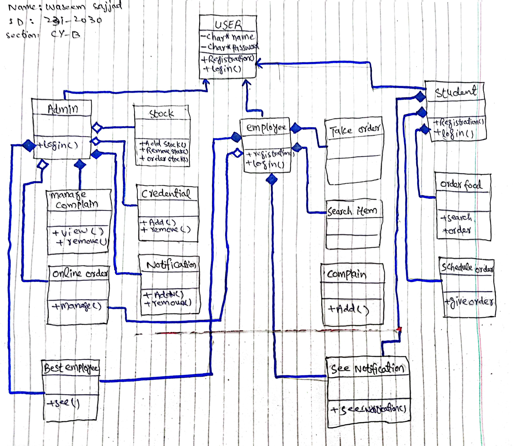
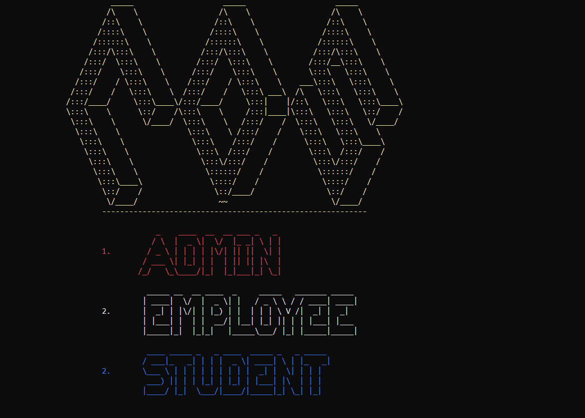
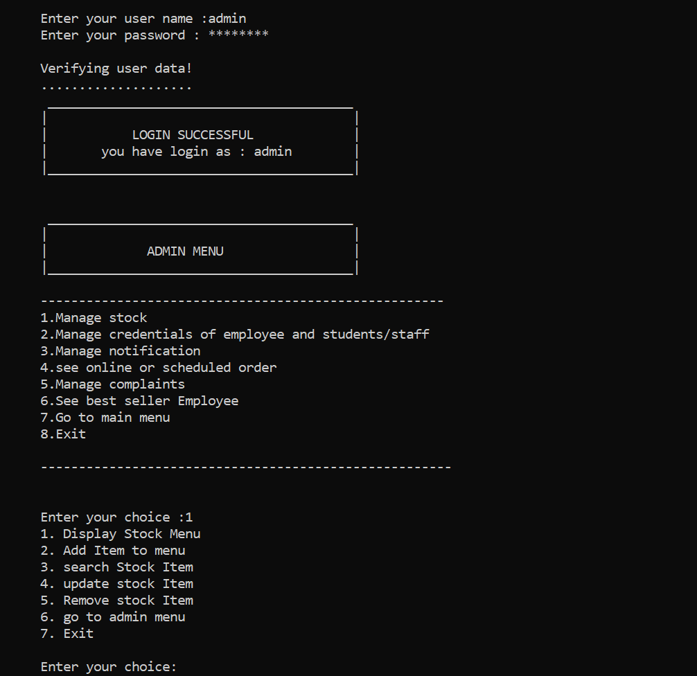
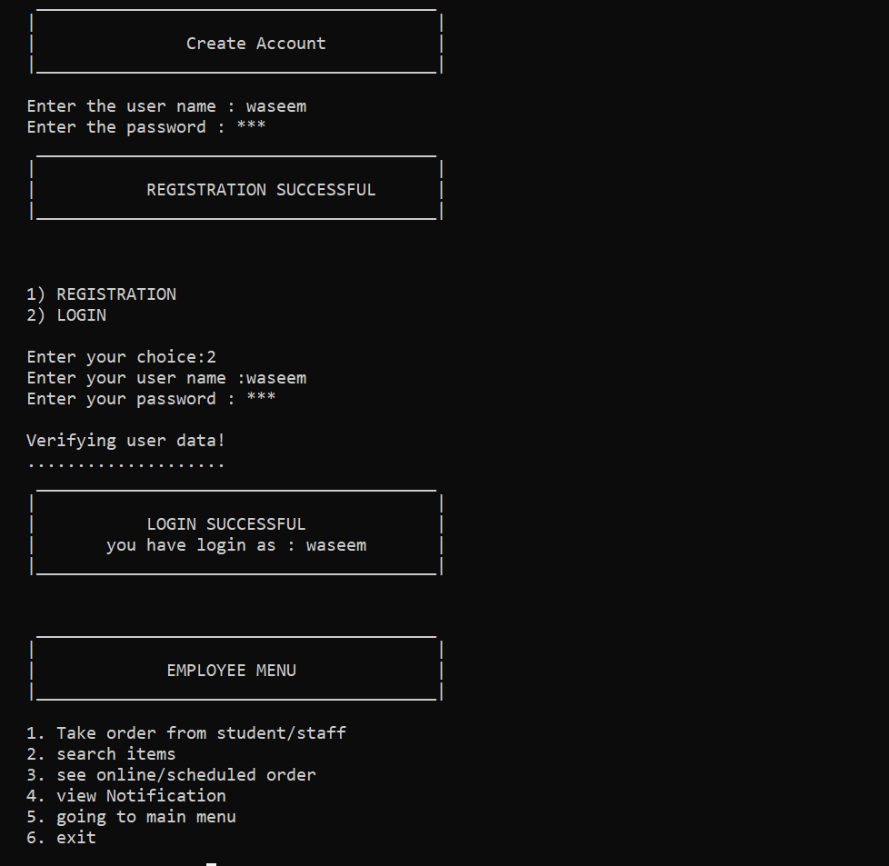
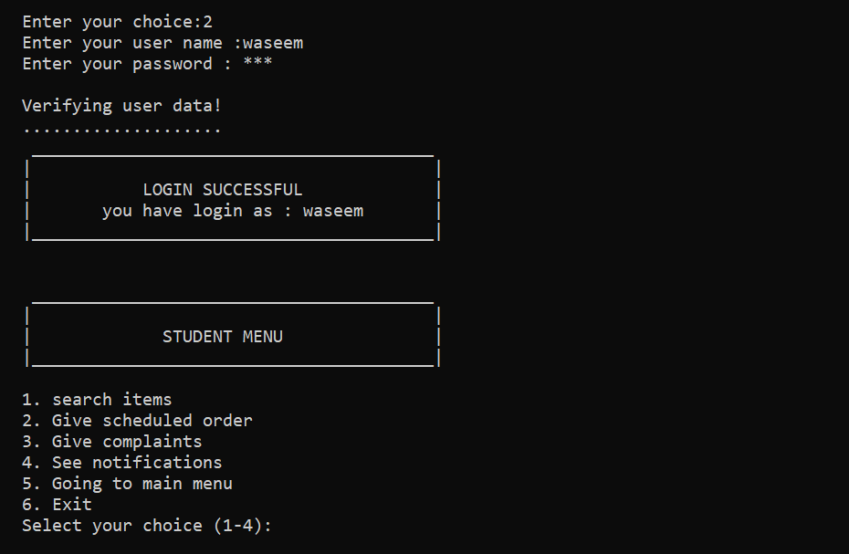

# CafeDigitalSystem-OOP
Cafe Digital System (CDS) is a C++ OOP-based console application designed to digitalize the operations of a university café. It features role-based login (admin, employees, students), real-time stock management, complaint handling, and sales tracking — all using file handling.

# Cafe Digital System (CDS) – C++ OOP Project

Welcome to **Cafe Digital System (CDS)** – a console-based management system built in C++ using Object-Oriented Programming. This project was created as a semester project for **CS1004 - OOP** at **FAST NUCES Islamabad** (Spring 2024), aimed at digitalizing and automating the Café workflow for both employees and administrators.

## 🚀 Features

### 👨‍💼 Admin Panel
- Secure login system with file-based credential management
- Add/remove/modify employee and user accounts
- View and manage full café stock (search, sort, update, delete)
- Low-stock detection with automatic **red alert** notifications
- Item restocking with quantity and price validation (max: 1000 units)
- View notifications, complaints, bestseller employees, and sales data

### 👷 Employee Interface
- Secure login system (at least 5 employee accounts)
- Take and manage orders from students/staff
- Generate digital transactions for each order
- View scheduled/online orders and notifications
- Access searchable item list

### 🧑‍🎓 Student/Staff Interface
- View café items and place orders
- Submit complaints (food, service, cleanliness)
- Schedule future orders
- View café notifications and promotions

## 📊 Stock Management System
Each stock item includes:
- Name
- Quantity
- Price per item
- Total Price (auto-calculated)

Other Stock Features:
- Search by Name, Price, or Quantity
- Sort in ascending/descending order using Bubble Sort
- Daily stock depletion simulation
- Red Alert: Quantity ≤ 15
- Yellow Warning: Quantity = 0

## 📈 Sales and Statistics
- Track daily sales using stock delta
- View most and least sold items
- Identify bestselling employee
- Calculate average/sum of quantities and total prices

## 💾 Data Persistence
- All data saved using file handling in `.txt` files:
  - `stocks.txt`
  - `credentials.txt`
  - `orders.txt`
  - `notifications.txt`
  - `complaints.txt`
- Persistent data ensures continuity across sessions.

## 🧠 Concepts Used
- Object-Oriented Programming
  - Classes, Inheritance, Polymorphism, Encapsulation
- File Handling (Text files)
- Bubble Sort (for sorting)
- Searching Algorithms
- Modular Design with Dynamic Arrays
- Console UI using `iostream` and C-style strings

## 🏫 University & Course Info

- **Institution:** FAST NUCES Islamabad  
- **Course:** CS1004 – Object-Oriented Programming  
- **Instructor:** professor Jawad Hassan  
- **Semester:** Spring 2024  
- **Developed By:** Waseem Sajjad (23rd Batch – Cyber Security)

## 📸 Screenshots & Diagram

### 🗂️ Class Diagram

### 🏠 Home Menu

### 🔐 Admin Login & Menu

### 👷 Employee Menu

### 🧑‍🎓 Student Menu

## ⚙️ How to Run

1. Compile using any C++ compiler:
   Run directly from the main.cpp. All files are linked together with main.cpp.

   ## 📬 Contact

If you face any issues running this project or have any questions, feel free to reach out:

📧 **Email:** wassem.sajjad.cybersec@gmail.com

